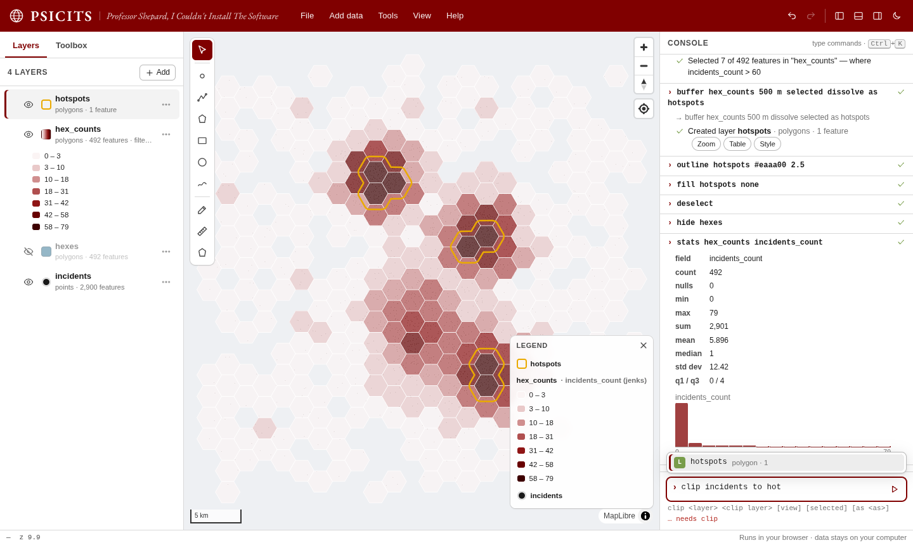

# PSICITS

### *Professor Shepard, I Couldn't Install The Software*

**A GIS that runs entirely in your web browser, driven by plain-text commands. It was built for GIS classes at the University of Chicago.**

Every term, a few students fall behind in week one because desktop GIS won't install on their laptop. Usually they lack admin rights, or have the wrong OS, or not enough disk space. PSICITS removes that excuse and that stress. You open a web page and start mapping. There is nothing to install and no account or API key, and it works on Windows, macOS, Linux and Chromebooks.

```
find University of Chicago
boundary Chicago
osm libraries in chicago
buffer libraries 1 mi dissolve as walkable
erase walkable from chicago as library_desert
export library_desert as shapefile
```

Everything runs locally in the browser, so your data never leaves your computer. Only basemap tiles, place search and OpenStreetMap downloads use the internet.



---

## Why a browser GIS

Desktop GIS (QGIS, ArcGIS Pro) is powerful, but it's a big install and a steep learning curve. PSICITS covers the everyday 80% of GIS work in a browser tab: load data, style it, run geoprocessing, and export it. You drive it with short commands you can read, repeat, and share:

- **Commands read like sentences:** `clip roads to "city limits"`, `select parcels within 500 m of rivers`, `dissolve counties by state sum population`.
  - Word order is flexible, fillers like "by", "to" and "the" are fine, and layer and field names are matched loosely.
  - Before you press Enter, the console shows how it understood you, for example `✓ clip roads to "city limits"`.
- **Autocomplete** suggests commands, layer names, fields, options and units as you type. Press Tab to accept.
- **Menus and forms still work.** Every toolbox form, layer menu and style dialog runs *and prints* the equivalent command, so clicking teaches the syntax.
- **Scripts are just text.** `history save` downloads what you did as a script, and the script editor runs it again. Assignments become reproducible and easy to hand in, check and share.
- **Real GDAL when you need it.** `ogr2ogr`, `gdalwarp`, `gdal_translate`, `gdal_rasterize`, `gdaldem` and `gdalinfo` run in the browser through WebAssembly, against the layers on your map, with their normal flags.

### For instructors

- **Hosting:** it's a static site. Put the folder on GitHub Pages, Canvas, or any university web space, and share one link.
- **Class exercises:** a URL like `…/index.html#run=sample%20us-states` runs commands when a student opens it. Students are asked to confirm first.
- **Handing in work:** students can hand in a `.psicits.json` project (`save`) or a text script (`history save`), which you can replay.

## Quick start

**Option 1 — just open it.** Download or clone this repository and double-click `index.html`. Everything works from disk except GDAL commands, which then load from a CDN the first time (internet needed).

**Option 2 — serve it locally** (recommended; GDAL then runs from the bundled copy in a background thread):

```bash
python -m http.server 8000      # or:  node tools/serve.js
# open http://localhost:8000
```

On Windows you can double-click **`start.bat`**. On macOS or Linux, run `./start.sh`.

**Option 3 — host it.** It's a static site. Push the repository to GitHub, turn on **Settings → Pages** (branch `main`, folder `/`), and share the link. Any static host works (Netlify, Cloudflare Pages, a university web space…).

## What it can do

| Area | Highlights |
|---|---|
| **Data in** | Drag and drop, or use `open` or `load <url>`. Supported: GeoJSON, TopoJSON, Shapefile (.zip, or .shp+.dbf+.prj), KML/KMZ, GPX, CSV/TSV with lat/lon or WKT (projected x/y is prompted for a CRS), Excel .xlsx, GeoPackage, FlatGeobuf, GeoTIFF/COG and WKT. Around 80 more formats go through GDAL, including File Geodatabase (.gdb.zip), DXF, MapInfo, GML, ODS, SQLite and ASCII grid. You can also load ArcGIS REST Feature/Map Server layers, WFS, and XYZ/WMS tiles. |
| **Web data** | `find <place>`, `geocode <address>`, `geocode table <layer> <field>`, `boundary <place>` (city/county/state polygons), `osm <what> in <place \| view \| layer>` (OpenStreetMap presets like hospitals, parks and bike lanes, or tags like `amenity=library`), raw `overpass` queries, and `sample` datasets. |
| **Style** | Single color, categories, graduated/choropleth (quantile, equal, Jenks, pretty, std-dev) with ColorBrewer/viridis ramps, proportional symbols, heatmaps, labels (field or expression), outlines, opacity, 3D extrusion, and a legend. Rasters: color ramps with stretch, RGB composites, categories. |
| **Select & query** | Select by attributes (`where …`) or by location (`within`, `intersecting`, `near`, `within 500 m of`), `filter` (display only), `extract`, `stats`, `unique`, `histogram`, `count`. |
| **Attributes** | `calc` field calculator with a safe expression language (`$area`, `$length`, aggregates like `sum("pop", "state")`, `CASE`, string and date functions), add/drop/rename fields, attribute `join`, and inline editing in the table. |
| **Vector tools** | buffer, multi-ring buffer, clip, erase, intersect, union, symmetric difference, dissolve (with stats), merge, spatial join, count points in polygons, nearest, centroids, convex/concave hull, bounding boxes, simplify, smooth, densify, Voronoi, Delaunay, explode, polygons↔lines, vertices, points along lines, line intersections, split, hex/square/triangle grids, random points, k-means/DBSCAN clustering, measure, validate/fix. |
| **Raster tools** | hillshade, slope, aspect, contours, band math (`(b5 - b4) / (b5 + b4)`), NDVI, reclassify, zonal statistics, sample values at points, IDW interpolation, clip, histogram. |
| **Draw & edit** | Points, lines, polygons, rectangles, circles and freehand shapes (Terra Draw). Vertex editing with drag, add and delete, and a measure tool for distance and area. |
| **GDAL** | `ogr2ogr` (including `-dialect SQLite -sql` with SpatiaLite functions), `ogrinfo`, `gdal_translate`, `gdalwarp` (with `-cutline <layer>`), `gdal_rasterize`, `gdaldem`, `gdalinfo`, `gdal_location_info`, `gdaltransform` and `gdalbuildvrt`. |
| **Data out** | GeoJSON, Shapefile, GeoPackage, KML, GPX, CSV, FlatGeobuf, WKT and GeoTIFF natively, plus any GDAL driver (DXF, File Geodatabase, MapInfo, XLSX, PMTiles, COG…), with optional reprojection (`crs EPSG:3435`). Also PNG map images and whole projects (`save`). |
| **Work safely** | Unlimited undo/redo, and autosave to your browser so a refresh doesn't lose work. `save` downloads a project file. |

Type `help` in the console for everything, `help <command>` for details, or see **[docs/COMMANDS.md](docs/COMMANDS.md)** (generated from the code).

## A few recipes

```
# Where are neighborhoods underserved by grocery stores?
boundary Chicago
osm supermarkets in chicago
buffer supermarkets 1 mi dissolve as walkable
erase walkable from chicago as food_desert

# Choropleth from a CSV of county statistics
open                                        # pick counties.shp.zip and stats.csv
join counties with stats on GEOID = geoid10
calc counties rate = cases / population * 100000
color counties by rate 7 jenks reds
label counties by NAME size 10

# Terrain from a DEM
open                                        # pick dem.tif
hillshade dem
contours dem 25
zonal dem by watersheds stats mean max

# Straight to GDAL
ogr2ogr -t_srs EPSG:3435 -f "ESRI Shapefile" parcels_il.shp parcels
gdalwarp -cutline city -crop_to_cutline dem dem_city.tif
ogr2ogr -dialect SQLite -sql "SELECT name, ST_Area(geometry) AS a FROM parcels" areas parcels
```

## How it works

PSICITS is plain HTML, CSS and JavaScript with no build step. Libraries are vendored in `vendor/`:

- **[MapLibre GL JS](https://maplibre.org)** renders the map (WebGL). The default basemaps come from [OpenFreeMap](https://openfreemap.org).
- **[Turf](https://turfjs.org)**, with PSICITS's own overlay engine, handles vector geoprocessing. **[RBush](https://github.com/mourner/rbush)** provides the spatial index.
- **[gdal3.js](https://github.com/bugra9/gdal3.js)** is GDAL, PROJ, GEOS and SpatiaLite compiled to WebAssembly. It is about 40 MB and loads on first use.
- **[Terra Draw](https://terradraw.io)** handles drawing and vertex editing.
- **[proj4js](http://proj4js.org)**, **[geotiff.js](https://geotiffjs.github.io)**, **[sql.js](https://sql.js.org)**, **[shpjs](https://github.com/calvinmetcalf/shapefile-js)**, **[togeojson](https://github.com/placemark/togeojson)**, **[PapaParse](https://www.papaparse.com)**, **[JSZip](https://stuk.github.io/jszip/)**, **[FlatGeobuf](https://flatgeobuf.org)** and **[osmtogeojson](https://github.com/tyrasd/osmtogeojson)** handle file formats and OpenStreetMap data.

The command console parses text into tool calls with a deterministic, typed slot-filling parser. There is no AI and no network call involved. See **[docs/ARCHITECTURE.md](docs/ARCHITECTURE.md)**.

## Development

```bash
node --test          # 230+ unit tests (formats, geoprocessing, raster, GDAL, expressions, commands, store)
node tools/serve.js  # local server on :8000
node tools/gen-commands-doc.js   # regenerate docs/COMMANDS.md after changing tools
```

Node is only needed for tests and tooling; the app itself has no build step. Read **[CONTRIBUTING.md](CONTRIBUTING.md)** and **[docs/CONVENTIONS.md](docs/CONVENTIONS.md)** before adding a tool (it's about 20 lines).

## Privacy and services

Files you open are read in the browser and never uploaded. These features contact public services directly from your browser:

- **Basemaps:** OpenFreeMap, Esri World Imagery, OpenTopoMap, OpenStreetMap tiles.
- **`find` / `geocode` / `boundary`:** OpenStreetMap Nominatim, with Photon as a fallback. Please respect their usage policies (about one request per second).
- **`osm` / `overpass`:** the Overpass API.
- **`sample`:** GitHub and USGS.
- **GDAL:** loads from jsDelivr only when the page is opened from disk.

## Branding

The colors and type are inspired by the University of Chicago's visual identity: Phoenix Maroon `#800000` as the dominant color, Light and Dark Greystone, Goldenrod and Ivy as sparing accents, EB Garamond for display type, and Helvetica/Arial for interface text, following [UChicago Creative](https://creative.uchicago.edu/color-system/). PSICITS is an independent teaching tool and **not an official University of Chicago product**. It does not use University logos or marks. Check the University's brand guidelines before adding any.

To rename the app, change `appName` and `appTagline` in `js/lib/core.js` and the fallback text in `index.html`. Colors live in the CSS variables at the top of `css/app.css`.

## License

MIT, see [LICENSE](LICENSE). Bundled third-party libraries keep their own licenses. gdal3.js is LGPL-2.1-or-later and is loaded as a separate, replaceable file. See [THIRD_PARTY_NOTICES.md](THIRD_PARTY_NOTICES.md).

Map data © [OpenStreetMap](https://www.openstreetmap.org/copyright) contributors.
